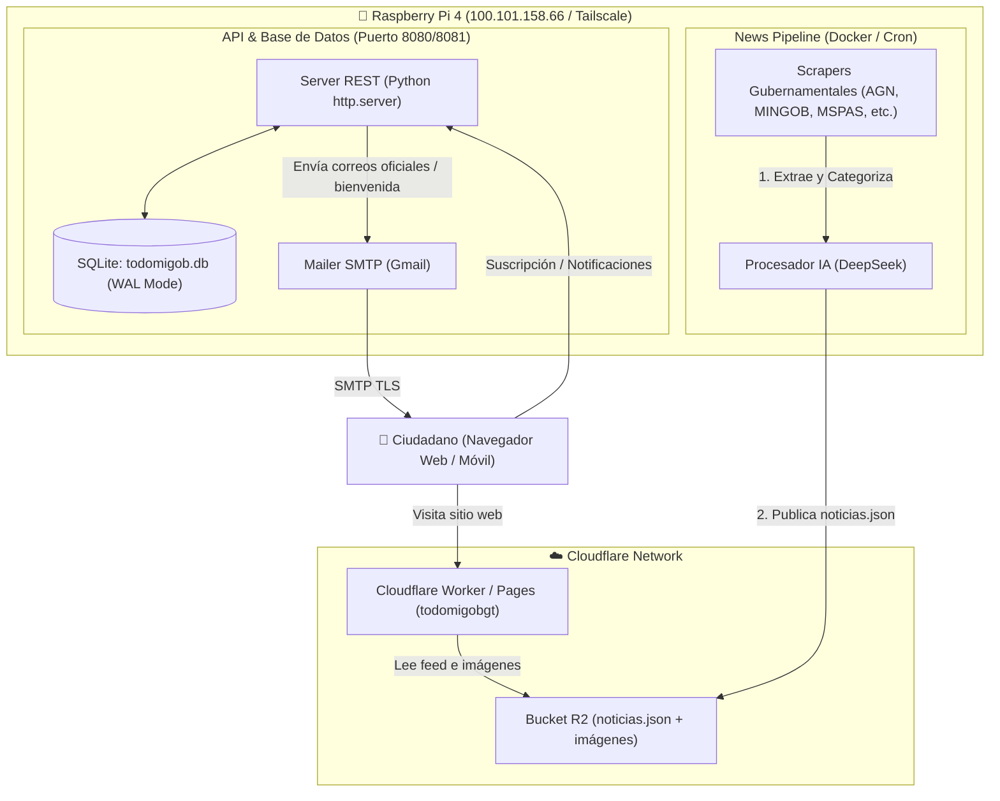

# 🚀 Guía Oficial de Despliegue de TODOMIGOB

Esta guía documenta paso a paso la arquitectura y el procedimiento de despliegue de todos los componentes que conforman la plataforma **TODOMIGOB**:
1. **Frontend Web & CDN:** Astro + TailwindCSS desplegado en **Cloudflare Workers & R2**.
2. **Backend 1 - News Pipeline & IA:** Scraper y procesamiento DeepSeek en **Docker (Raspberry Pi 4 ARM64)** sincronizado con **Cloudflare R2**.
3. **Backend 2 - Suscripciones & Notificaciones:** Servidor API REST en **Python 3**, base de datos **SQLite WAL** y despachador **SMTP** en **Raspberry Pi 4** expuesto vía **Tailscale**.

---

## 📐 1. Arquitectura General del Sistema



---

## 📋 2. Matriz de Componentes y Entornos

| Componente | Tecnología | Destino de Despliegue | URL / Host de Producción |
| :--- | :--- | :--- | :--- |
| **Frontend Web** | Astro 5, Tailwind v4, TypeScript | Cloudflare Workers / Pages | `https://todomigobgt.<subdominio>.workers.dev` |
| **Almacenamiento Multimedia** | Cloudflare R2 | Cloudflare Object Storage | `https://pub-b246f9594b0f4cb5960b8f6ec9f1ba2b.r2.dev/` |
| **News Pipeline** | Node.js 20, TypeScript, Docker | Raspberry Pi 4 ARM64 (`cron`) | Servidor local `/home/trebol4devop/news-pipeline` |
| **API & Suscripciones** | Python 3.12, SQLite3 | Raspberry Pi 4 (Systemd / Docker) | `https://trebol4devop.tail41b60f.ts.net` o `http://100.101.158.66:8081` |

---

## 🌐 3. Despliegue del Frontend (Cloudflare Workers / Pages)

El frontend está desarrollado en Astro y empaquetado para correr como Cloudflare Worker sirviendo los activos estáticos y conectándose en tiempo real con el bucket Cloudflare R2.

### Requisitos Previos:
- Node.js 20+ y `pnpm` (o `npm`).
- Autenticación en Cloudflare CLI (`npx wrangler login`).

### Variables de Entorno del Frontend (`.env`):
```bash
# URL de conexión con la API del backend en Raspberry Pi (Tailscale Funnel o IP directa)
PUBLIC_API_URL=https://trebol4devop.tail41b60f.ts.net
```

### Pasos de Despliegue:

1. **Instalar dependencias:**
   ```bash
   pnpm install
   ```

2. **Compilar la aplicación Astro:**
   ```bash
   pnpm run build
   ```
   *Esto generará los artefactos de producción en la carpeta `dist/`.*

3. **Publicar a Cloudflare Workers con Wrangler:**
   ```bash
   npx wrangler deploy
   ```

4. **Verificar el archivo `wrangler.toml`:**
   Asegúrate de que la configuración mantenga el enlace al bucket R2:
   ```toml
   name = "todomigobgt"
   main = "./worker.js"
   compatibility_date = "2026-09-10"

   [assets]
   directory = "./dist"
   binding = "ASSETS"

   [[r2_buckets]]
   binding = "DB"
   bucket_name = "todomigobgt"
   ```

---

## 🍓 4. Despliegue de Backend 1: News Pipeline (Raspberry Pi)

El pipeline de extracción de noticias es un proceso batch que se ejecuta de forma periódica para raspar fuentes ministeriales, estructurarlas mediante DeepSeek y subirlas a Cloudflare R2.

### Acceso a la Raspberry Pi:
```bash
ssh trebol4devop@100.101.158.66
```

### Configuración del Directorio y Variables (`.env`):
En la Raspberry Pi, dentro de `/home/trebol4devop/news-pipeline/.env`:

```ini
# DeepSeek AI
DEEPSEEK_API_KEY=tu_api_key_de_deepseek
DEEPSEEK_MODEL=deepseek-chat

# Cloudflare R2 Bucket
S3_ENDPOINT=https://<account_id>.r2.cloudflarestorage.com
R2_ACCESS_KEY_ID=tu_access_key_r2
R2_SECRET_ACCESS_KEY=tu_secret_key_r2
R2_BUCKET_NAME=todomigobgt
R2_PUBLIC_BASE_URL=https://pub-b246f9594b0f4cb5960b8f6ec9f1ba2b.r2.dev

# Configuración de ejecución
PIPELINE_OUTPUT_PATH=/app/output/noticias.json
LOG_LEVEL=info
```

### Ejecución mediante Docker:

1. **Descargar o construir la imagen ARM64:**
   ```bash
   docker pull estebansnzt/government-news-pipeline:v2-arm64
   ```

2. **Probar ejecución manual:**
   ```bash
   docker run --rm \
     --env-file /home/trebol4devop/news-pipeline/.env \
     -v /home/trebol4devop/news-pipeline/output:/app/output \
     estebansnzt/government-news-pipeline:v2-arm64
   ```

3. **Programar ejecución periódica con Cron (cada 12 horas):**
   Ejecuta `crontab -e` y agrega:
   ```cron
   0 0,12 * * * docker run --rm --env-file /home/trebol4devop/news-pipeline/.env -v /home/trebol4devop/news-pipeline/output:/app/output estebansnzt/government-news-pipeline:v2-arm64 >> /home/trebol4devop/news-pipeline/pipeline.log 2>&1
   ```

---

## 📬 5. Despliegue de Backend 2: API, Base de Datos & Notificaciones (`raspberry-pi`)

Este servicio corre de forma continua en la Raspberry Pi. Expone los endpoints de suscripción de ciudadanos (`/api/users`), consulta de categorías y envío automático de correos (incluyendo el correo de bienvenida con las últimas noticias del bucket R2).

### Variables de Entorno (`.env`):
En `/home/trebol4devop/todomigob-backend/.env` (o en la carpeta `raspberry-pi`):

```ini
PORT=8080
HOST=0.0.0.0
DB_PATH=todomigob.db

# Configuración SMTP Gmail
SMTP_HOST=smtp.gmail.com
SMTP_PORT=465
SMTP_USER=trebol4devop@gmail.com
SMTP_PASS=lykc jsej osgf ezee
SMTP_FROM_NAME=TODOMIGOB Notificaciones Oficiales

# Enlace al Frontend para los correos
APP_URL=https://trebol4devop.tail41b60f.ts.net
R2_BUCKET_URL=https://pub-b246f9594b0f4cb5960b8f6ec9f1ba2b.r2.dev/noticias.json
```

---

### Opción A: Despliegue como Servicio Nativo `systemd` (Recomendado)

1. **Crear archivo de servicio en `/etc/systemd/system/todomigob.service`:**
   ```ini
   [Unit]
   Description=TODOMIGOB Notification & Database API Server
   After=network.target

   [Service]
   Type=simple
   User=trebol4devop
   WorkingDirectory=/home/trebol4devop/todomigob-backend
   EnvironmentFile=/home/trebol4devop/todomigob-backend/.env
   ExecStart=/usr/bin/python3 /home/trebol4devop/todomigob-backend/server.py
   Restart=always
   RestartSec=5

   [Install]
   WantedBy=multi-user.target
   ```

2. **Habilitar e Iniciar el Servicio:**
   ```bash
   sudo systemctl daemon-reload
   sudo systemctl enable todomigob
   sudo systemctl start todomigob
   sudo systemctl status todomigob
   ```

3. **Monitorear logs en tiempo real:**
   ```bash
   journalctl -u todomigob -f
   ```

---

### Opción B: Despliegue con Docker y Docker Compose

Si prefieres usar contenedores para el servidor de notificaciones:

1. **Levantar el contenedor con Compose:**
   ```bash
   docker compose up -d --build
   ```

2. **Verificar estado y logs:**
   ```bash
   docker compose ps
   docker compose logs -f
   ```

---

## 🔒 6. Exposición de Red Segura con Tailscale

Para que el frontend en Cloudflare pueda consumir la API que corre en la Raspberry Pi sin abrir puertos inseguros en el router residencial:

1. **Tailscale Funnel (HTTPS Público):**
   ```bash
   sudo tailscale funnel 8080
   ```
   *Esto expone el servicio directamente bajo el dominio:*  
   `https://trebol4devop.tail41b60f.ts.net`

2. **O Red Privada Tailscale (VPN):**
   Nodo accesible únicamente dentro de la red del equipo en:  
   `http://100.101.158.66:8081`

---

## 🧪 7. Pruebas de Verificación Post-Despliegue

### 1. Verificar salud del Backend en Raspberry Pi:
```bash
curl -I https://trebol4devop.tail41b60f.ts.net/api/health
# Debe responder: HTTP/1.1 200 OK
# {"status": "ok", "service": "todomigob-raspi", "db": "todomigob.db"}
```

### 2. Probar registro de ciudadano y envío de bienvenida:
```bash
curl -X POST https://trebol4devop.tail41b60f.ts.net/api/users \
  -H "Content-Type: application/json" \
  -d '{
    "name": "Prueba Despliegue",
    "email": "tu_correo@gmail.com",
    "preferences": ["seguridad", "salud"]
  }'
```
*Respuesta esperada:* `201 Created` con `{ "id": ..., "is_new": true }` y se dispara el correo de bienvenida en segundo plano.

### 3. Verificar disponibilidad de noticias en Cloudflare R2:
```bash
curl -I https://pub-b246f9594b0f4cb5960b8f6ec9f1ba2b.r2.dev/noticias.json
# Debe responder: HTTP/2 200 OK con Content-Type: application/json
```

---

## 🆘 Troubleshooting y Preguntas Frecuentes

| Síntoma | Causa Probable | Solución |
| :--- | :--- | :--- |
| **Error CORS al suscribirse desde la web** | La URL configurada no coincide o falta encabezado OPTIONS. | Revisar `PUBLIC_API_URL` en el frontend y verificar que `server.py` responde en `do_OPTIONS` con cabeceras `Access-Control-Allow-Origin: *`. |
| **Los correos no salen (`SMTPAuthenticationError`)** | La contraseña de aplicación de Gmail expiró o tiene espacios no permitidos. | Generar una nueva contraseña de aplicación en la cuenta de Google y actualizar `SMTP_PASS` en el `.env`. |
| **Fallo en Cloudflare R2 (`403 Forbidden` o `SignatureDoesNotMatch`)** | Claves de API de Cloudflare R2 inválidas en el pipeline. | Regenerar el Token de API en Cloudflare Dashboard con permisos de *Object Read & Write* en el bucket `todomigobgt`. |
| **Servicio caído en la Raspberry Pi tras reinicio** | El servicio systemd no estaba habilitado. | Ejecutar `sudo systemctl enable todomigob` para asegurar arranque automático al reiniciar la RasPi. |
